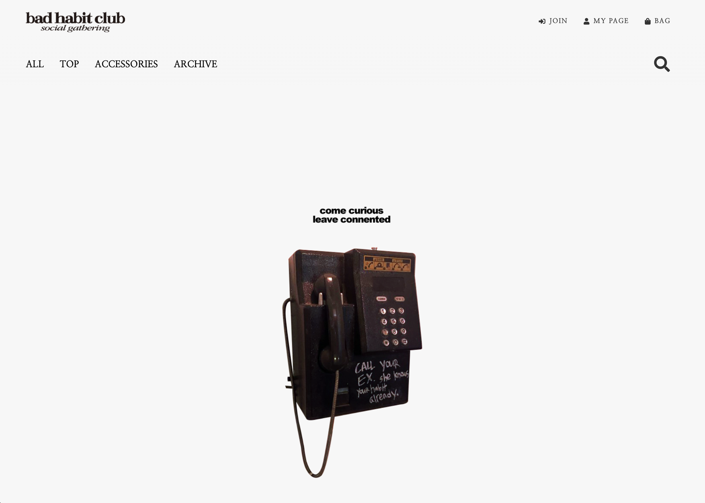
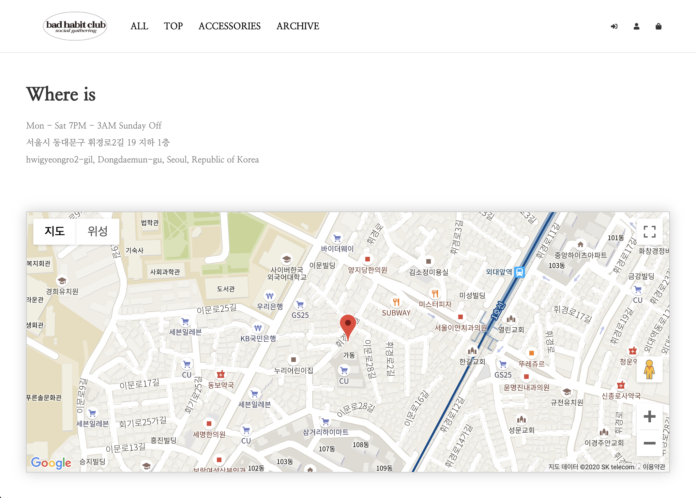
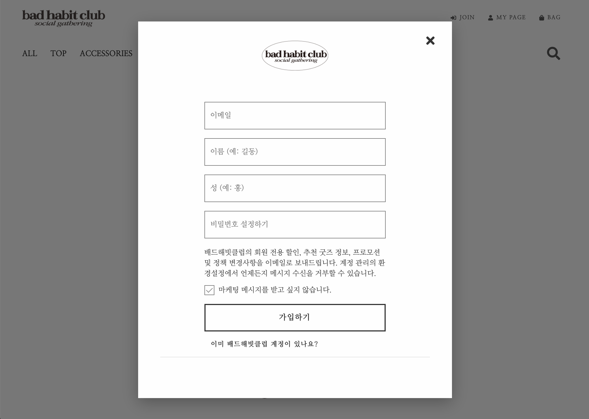
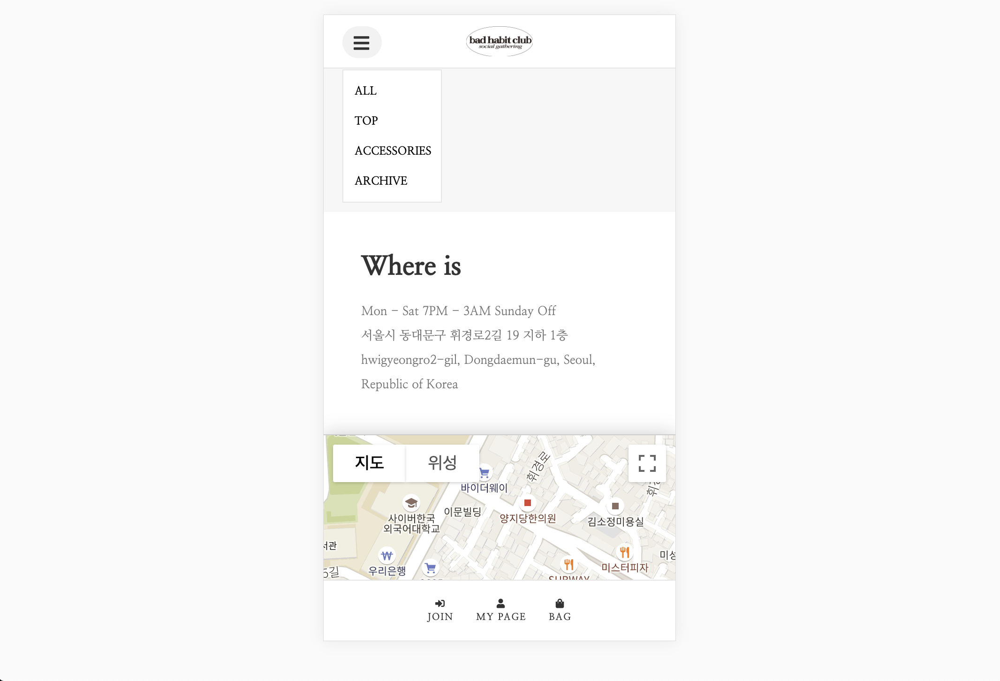

# 𝐁𝐚𝐝𝐇𝐚𝐛𝐢𝐭𝐂𝐥𝐮𝐛 𝐅𝐫𝐨𝐧𝐭

<br>

## Preview










<br>

## Project setup

### Install dependencies

```
npm install
```

<br>

### Compiles and hot-reloads for development

```
npm run serve
```

<br>

### Compiles and minifies for production

```
npm run build
```

<br>

### Lints and fixes files

```
npm run lint
```

<br>

### Customize configuration

See [Configuration Reference](https://cli.vuejs.org/config/).

<br>
